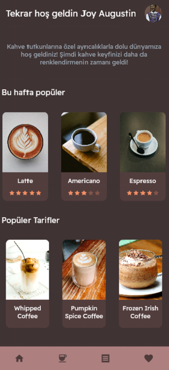
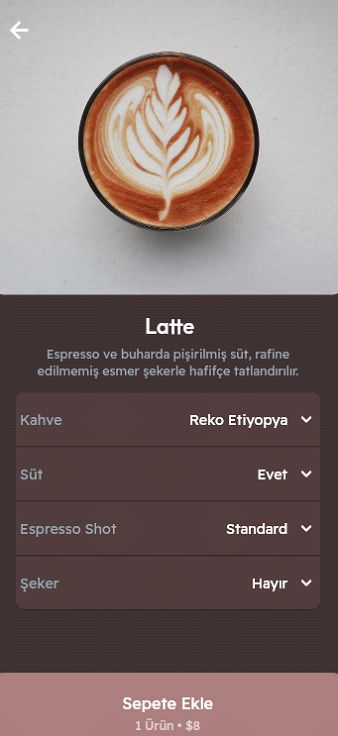
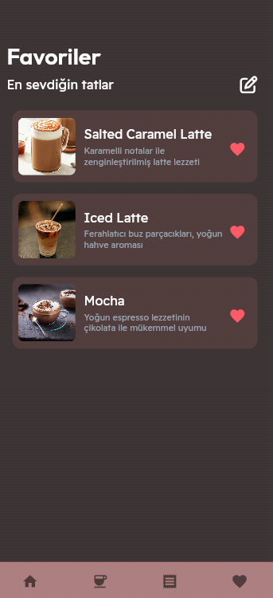
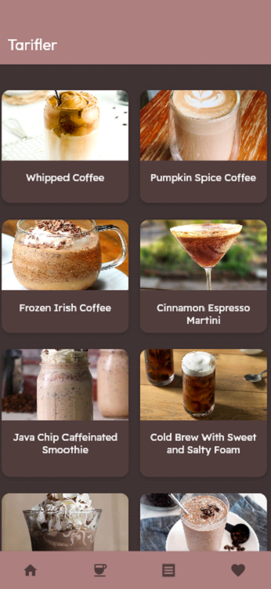
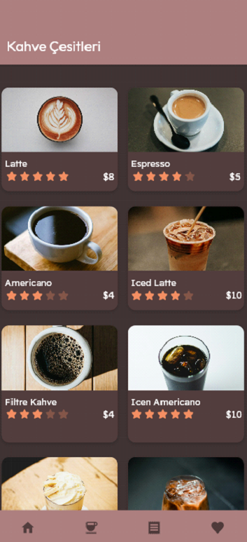

# ☕ Coffee Order App – Flutter

Flutter ile Dart programlama dili kullanılarak geliştirilmiş modern bir kahve sipariş uygulaması.  
Kullanıcılar hesap oluşturabilir, kahve ürünlerini inceleyebilir, sipariş verebilir, favori listesi oluşturabilir ve uygulama içindeki kahve tariflerine erişebilir.

---

## 🎯 Projenin Amacı
Kullanıcıların kahve çeşitlerini keşfedebileceği, favori ürünlerini yönetebileceği, sipariş oluşturabileceği ve çeşitli kahve tariflerine ulaşabileceği kapsamlı bir mobil uygulama geliştirmek.

---

## 📱 Uygulama Özellikleri

### 🛒 Sipariş & Ürün Yönetimi
- Kahve ürünlerini listeleme  
- Ürün detaylarını görüntüleme  
- Sepete ürün ekleme ve sepetten çıkarma  
- Sipariş oluşturma  

### ⭐ Favori Ürünler
- Kullanıcı favori kahvelerini işaretleyebilir  
- Favoriler sayfasından listeyi görüntüleyebilir  
- Favorilerden çıkarma işlemi yapabilir  

### 📖 Kahve Tarifleri
- Özel tarifler bölümü  
- Farklı kahve türleri hakkında hazırlama tarifleri  
- Tarif detay sayfaları  

### 👤 Kullanıcı İşlemleri
- Kullanıcı hesabı oluşturma  
- Giriş yapma  
- Hesap bilgilerine göre kişiselleştirilmiş içerik  

---

## 🛠️ Kullanılan Teknolojiler
- **Flutter**
- **Dart**
- **Android Studio**

---

## 📸 Ekran Görselleri

